# Trap-Intel Domain Model - Entities, Aggregates & Relations

## Overview

This document provides a comprehensive overview of all entities, aggregate roots, value objects, and their relationships in the Trap-Intel domain layer. The domain follows Domain-Driven Design (DDD) principles with rich domain models.

**Last Updated:** Based on Phase 2 refactoring with proper child entities

---

## Table of Contents

1. [Aggregate Roots](#aggregate-roots)
2. [Child Entities](#child-entities)
3. [Value Objects](#value-objects)
4. [Domain Events](#domain-events)
5. [Entity Relationship Diagram](#entity-relationship-diagram)
6. [Bounded Contexts](#bounded-contexts)

---

## Aggregate Roots

### 1. Organization
**Namespace:** `Trap_Intel.Domain.Organizations`

The root entity for multi-tenant organization management.

| Property | Type | Description |
|----------|------|-------------|
| Id | Guid | Unique identifier |
| Name | string | Organization name |
| Type | OrganizationType | Enterprise, SMB, Startup, etc. |
| Industry | string | Industry sector |
| Size | int | Organization size |
| Domain | OrganizationDomain | Domain value object |
| TaxId | TaxIdentifier | Tax identifier value object |
| ContactInfo | ContactInfo | Contact information |
| Website | string | Organization website |
| Settings | OrganizationSettings | Configuration settings |
| Status | OrganizationStatus | PendingApproval, Active, Suspended, Inactive |
| ParentOrganizationId | Guid? | For hierarchical organizations |
| Addresses | List\<OrganizationAddress\> | Collection of addresses |
| CreatedAt | DateTime | Creation timestamp |
| UpdatedAt | DateTime | Last update timestamp |
| ApprovedAt | DateTime? | Approval timestamp |
| ApprovedByUserId | Guid? | Who approved |

**Relations:**
- Parent ? `Organization` (self-referential, optional)
- Contains ? `OrganizationAddress` (1:N)
- Has ? `User` (1:N)
- Has ? `Subscription` (1:N)
- Has ? `Honeypot` (1:N)
- Has ? `Alert` (1:N)
- Has ? `ThreatActor` (1:N)

---

### 2. User
**Namespace:** `Trap_Intel.Domain.Identity`

User identity and authentication management.

| Property | Type | Description |
|----------|------|-------------|
| Id | Guid | Unique identifier |
| OrganizationId | Guid | Associated organization |
| Email | UserEmail | Email value object |
| UserName | UserName | Username value object |
| FirstName | FirstName | First name value object |
| LastName | LastName | Last name value object |
| Status | UserStatus | PendingActivation, Active, Inactive, Suspended |
| Role | UserRole | Viewer, Analyst, OrganizationAdmin, SuperAdmin |
| Preferences | UserPreferences | User preferences |
| PhoneNumber | string? | Phone number |
| LastLoginAt | DateTime? | Last login timestamp |
| CreatedAt | DateTime | Creation timestamp |
| UpdatedAt | DateTime | Last update timestamp |

**Relations:**
- Belongs to ? `Organization` (N:1)

---

### 3. Subscription
**Namespace:** `Trap_Intel.Domain.Subscriptions`

Subscription and billing management.

| Property | Type | Description |
|----------|------|-------------|
| Id | Guid | Unique identifier |
| OrganizationId | Guid | Associated organization |
| PlanId | Guid | Associated plan |
| Status | SubscriptionStatus | Trial, Active, Suspended, Cancelled, Expired |
| Period | SubscriptionPeriod | Start and end dates |
| BillingCycle | BillingCycle | Monthly, Yearly |
| BillingInfo | BillingInfo | Billing details |
| Usage | UsageStatistics | Current usage |
| PaymentMethodId | Guid? | Associated payment method |
| IsAutoRenew | bool | Auto-renewal flag |
| CancellationInfo | CancellationInfo? | Cancellation details |
| Quotas | List\<SubscriptionQuotaEntity\> | Quota history entities |
| UsageSnapshots | List\<UsageSnapshot\> | Usage snapshot entities |
| MonthlySummaries | List\<MonthlyUsageSummary\> | Monthly usage entities |
| CreatedAt | DateTime | Creation timestamp |
| UpdatedAt | DateTime | Last update timestamp |

**Child Entities:**
- `SubscriptionQuotaEntity` - Quota limits with effective period tracking
- `UsageSnapshot` - Point-in-time usage snapshots for trending
- `MonthlyUsageSummary` - Aggregated monthly usage for billing

**Relations:**
- Belongs to ? `Organization` (N:1)
- References ? `Plan` (N:1)
- Has ? `PaymentMethod` (optional, N:1)
- Has ? `Invoice` (1:N)
- Has ? `Honeypot` (1:N)

---

### 4. Plan
**Namespace:** `Trap_Intel.Domain.Plans`

Subscription plans and pricing.

| Property | Type | Description |
|----------|------|-------------|
| Id | Guid | Unique identifier |
| Name | string | Plan name |
| Description | string | Plan description |
| Type | PlanType | Free, Starter, Professional, Enterprise |
| SupportTier | SupportTierConfig | Support configuration |
| ComplianceConfig | ComplianceConfig | Compliance features |
| CustomizationLevel | CustomizationLevel | Customization options |
| AIFeatures | AIFeaturesConfig? | AI features |
| ThreatIntelligence | ThreatIntelligenceConfig? | Threat intel features |
| Pricing | Dictionary\<BillingCycle, PlanPrice\> | Pricing tiers |
| IsActive | bool | Active status |
| CreatedAt | DateTime | Creation timestamp |
| UpdatedAt | DateTime | Last update timestamp |

**Relations:**
- Has ? `Subscription` (1:N)

---

### 5. Honeypot
**Namespace:** `Trap_Intel.Domain.Honeypots`

Honeypot deployment and monitoring.

| Property | Type | Description |
|----------|------|-------------|
| Id | Guid | Unique identifier |
| OrganizationId | Guid | Owning organization |
| SubscriptionId | Guid | Associated subscription |
| Name | string | Honeypot name |
| Type | HoneypotType | SSH, HTTP, FTP, SMB, etc. |
| Status | HoneypotStatus | Provisioning, Active, Paused, Error, Terminated |
| Configuration | HoneypotConfiguration | Configuration settings |
| DeploymentLocation | HoneypotDeploymentLocation | Cloud, OnPremise, Hybrid |
| ExternalService | ExternalServiceReference? | External Go service link |
| NetworkInfo | HoneypotNetworkInfo? | Network configuration |
| Health | HoneypotHealth | Health metrics |
| Statistics | HoneypotStatistics | Capture statistics |
| HeartbeatStatus | HeartbeatStatus | Connection status |
| AgentId | string? | Go agent ID |
| AgentVersion | string? | Agent version |
| Notes | List\<string\> | Operational notes |
| CreatedAt | DateTime | Creation timestamp |
| DeployedAt | DateTime? | Deployment timestamp |
| TerminatedAt | DateTime? | Termination timestamp |

**Relations:**
- Belongs to ? `Organization` (N:1)
- Belongs to ? `Subscription` (N:1)
- Has ? `AttackEvent` (1:N)
- Has ? `AgentCommand` (1:N)

---

### 6. AttackEvent
**Namespace:** `Trap_Intel.Domain.Attacks`

Attack events captured by honeypots.

| Property | Type | Description |
|----------|------|-------------|
| Id | Guid | Unique identifier |
| HoneypotId | Guid | Source honeypot |
| OrganizationId | Guid | Owning organization |
| ExternalEventId | string | ID from Go honeypot |
| Timestamp | DateTime | Attack timestamp |
| SourceEndpoint | NetworkEndpoint | Attacker endpoint |
| TargetEndpoint | NetworkEndpoint | Honeypot endpoint |
| SensorId | string | Go agent sensor ID |
| AttackType | AttackType | SSH, HTTP, FTP, Malware, etc. |
| Protocol | AttackProtocol | TCP, UDP, HTTP, etc. |
| Severity | AttackSeverity | Low, Medium, High, Critical |
| ThreatScore | decimal | AI-calculated score (0-100) |
| Intent | AttackIntent | AI-classified intent |
| IsAnalyzed | bool | AI analysis complete |
| IsAnomaly | bool | Anomaly detection flag |
| Credentials | AttackCredentials? | Login credentials |
| Command | string? | Executed command |
| Payload | byte[]? | Malware payload |
| FileHash | string? | SHA256 hash |
| UserAgent | string? | User agent string |
| Headers | Dictionary\<string, string\> | HTTP headers |
| Geolocation | GeoLocation | Attacker location |
| MitreTechniques | List\<MitreTechnique\> | MITRE ATT&CK |
| ThreatActorId | Guid? | Linked threat actor |
| RawDataJson | string | Raw JSON payload |
| ReceivedAt | DateTime | .NET receipt time |

**Relations:**
- Belongs to ? `Honeypot` (N:1)
- Belongs to ? `Organization` (N:1)
- References ? `ThreatActor` (optional, N:1)

---

### 7. ThreatActor
**Namespace:** `Trap_Intel.Domain.ThreatActors`

Threat actor profiles from correlated attacks.

| Property | Type | Description |
|----------|------|-------------|
| Id | Guid | Unique identifier |
| OrganizationId | Guid | Owning organization |
| Alias | string? | Display name |
| Type | ThreatActorType | Unknown, APT, Botnet, Individual, etc. |
| ThreatLevel | ThreatLevel | Unknown, Low, Medium, High, Severe |
| Status | ThreatActorStatus | Active, Monitored, Blocked, FalsePositive |
| Confidence | IdentificationConfidence | Low, Medium, High, Confirmed |
| Motivation | ThreatMotivation | Financial, Espionage, etc. |
| Region | ThreatRegion | Geographic region |
| ThreatScore | decimal | Score (0-100) |
| ScoreBreakdown | ThreatScoreBreakdown? | Score components |
| Stats | ThreatActorStats | Activity statistics |
| AssociatedIPs | List\<ThreatActorIPEntity\> | Associated IP entities |
| CorrelatedAttackIds | List\<Guid\> | Linked attack events |
| TargetedHoneypotIds | List\<Guid\> | Targeted honeypots |
| ObservedTTPs | List\<ThreatActorTTPEntity\> | MITRE TTP entities |
| BehaviorPatterns | List\<BehaviorPatternEntity\> | Behavior pattern entities |
| IntelNotes | List\<ThreatIntelNoteEntity\> | Intelligence note entities |
| CreatedAt | DateTime | Creation timestamp |
| UpdatedAt | DateTime | Last update timestamp |

**Child Entities:**
- `ThreatActorIPEntity` - IP addresses with geolocation, blocking, reputation
- `ThreatActorTTPEntity` - MITRE ATT&CK techniques with usage tracking
- `BehaviorPatternEntity` - Detected behavior patterns with confidence
- `ThreatIntelNoteEntity` - Intelligence notes with editing, deletion, tagging

**Relations:**
- Belongs to ? `Organization` (N:1)
- Has ? `AttackEvent` (1:N correlation)
- References ? `Honeypot` (M:N via targeted list)

---

### 8. Alert
**Namespace:** `Trap_Intel.Domain.Alerts`

System alerts and notifications.

| Property | Type | Description |
|----------|------|-------------|
| Id | Guid | Unique identifier |
| OrganizationId | Guid | Owning organization |
| AlertType | AlertType | HighSeverityAttack, HoneypotOffline, etc. |
| Severity | AlertSeverity | Low, Medium, High, Critical |
| Priority | AlertPriority | Low, Normal, High, Urgent, Emergency |
| Title | string | Alert title |
| Description | string | Alert description |
| Status | AlertStatus | New, Acknowledged, InProgress, Resolved, etc. |
| Source | AlertSource | What triggered the alert |
| EscalationLevel | EscalationLevel | Level1 through External |
| AssignedToUserId | Guid? | Assigned user |
| AcknowledgedByUserId | Guid? | Who acknowledged |
| AcknowledgedAt | DateTime? | Acknowledgement time |
| ResolvedByUserId | Guid? | Who resolved |
| ResolvedAt | DateTime? | Resolution time |
| Resolution | string? | Resolution description |
| SnoozeInfo | SnoozeConfig? | Snooze configuration |
| Actions | List\<AlertActionEntity\> | Action audit trail entities |
| Comments | List\<AlertCommentEntity\> | Comment entities |
| Notifications | List\<AlertNotificationEntity\> | Notification entities |
| Escalations | List\<AlertEscalationEntity\> | Escalation history entities |
| CreatedAt | DateTime | Creation timestamp |
| ExpiresAt | DateTime? | Expiration time |

**Child Entities:**
- `AlertActionEntity` - Full audit trail of all actions taken
- `AlertCommentEntity` - Threaded comments with edit/delete support
- `AlertNotificationEntity` - Notification delivery tracking with retries
- `AlertEscalationEntity` - Escalation history with SLA tracking

**Relations:**
- Belongs to ? `Organization` (N:1)
- References ? `User` (assigned, acknowledged, resolved)

---

### 9. AgentCommand
**Namespace:** `Trap_Intel.Domain.Commands`

Commands sent to Go honeypot agents.

| Property | Type | Description |
|----------|------|-------------|
| Id | Guid | Unique identifier |
| HoneypotId | Guid | Target honeypot |
| OrganizationId | Guid | Owning organization |
| IssuedByUserId | Guid | Issuing user |
| CommandType | AgentCommandType | Restart, BlockIP, UpdateConfig, etc. |
| Payload | CommandPayload | Command payload (JSON) |
| Priority | CommandPriority | Low, Normal, High, Critical |
| Timeout | CommandTimeout | Timeout configuration |
| Status | AgentCommandStatus | Pending, Sent, Acknowledged, InProgress, Completed, Failed |
| DeliveryMethod | CommandDeliveryMethod | Immediate, Scheduled, Queued |
| ExecutionResult | CommandResult? | Result from agent |
| ErrorMessage | string? | Error message |
| RetryCount | int | Retry attempts |
| CreatedAt | DateTime | Creation timestamp |
| SentAt | DateTime? | Sent timestamp |
| AcknowledgedAt | DateTime? | Acknowledgement time |
| ExecutionStartedAt | DateTime? | Execution start |
| CompletedAt | DateTime? | Completion time |
| ScheduledFor | DateTime? | Scheduled time |
| TimeoutAt | DateTime? | Timeout deadline |

**Relations:**
- Belongs to ? `Honeypot` (N:1)
- Belongs to ? `Organization` (N:1)
- Issued by ? `User` (N:1)

---

### 10. Invoice
**Namespace:** `Trap_Intel.Domain.Billing`

Billing invoices.

| Property | Type | Description |
|----------|------|-------------|
| Id | Guid | Unique identifier |
| SubscriptionId | Guid | Associated subscription |
| OrganizationId | Guid | Owning organization |
| InvoiceNumber | InvoiceNumber | Invoice number |
| Status | InvoiceStatus | Draft, Issued, Paid, Overdue, Cancelled, Refunded |
| BillingPeriod | BillingPeriod | Billing period |
| Amount | InvoiceAmount | Amount details |
| UsageDetails | UsageDetails | Usage details |
| TaxInfo | TaxInfo | Tax information |
| IssueDate | DateTime? | Issue date |
| DueDate | DateTime? | Due date |
| PaymentId | Guid? | Associated payment |
| Notes | List\<string\> | Invoice notes |
| CreatedAt | DateTime | Creation timestamp |
| UpdatedAt | DateTime | Last update timestamp |

**Relations:**
- Belongs to ? `Subscription` (N:1)
- Belongs to ? `Organization` (N:1)

---

### 11. PaymentMethod
**Namespace:** `Trap_Intel.Domain.Billing`

Payment methods for billing.

| Property | Type | Description |
|----------|------|-------------|
| Id | Guid | Unique identifier |
| OrganizationId | Guid | Owning organization |
| Type | PaymentMethodType | CreditCard, DebitCard, BankTransfer, PayPal, etc. |
| Details | PaymentMethodDetails | Masked card/account details |
| Status | PaymentMethodStatus | Active, Inactive, Suspended, Expired |
| IsDefault | bool | Default payment method |
| CreatedAt | DateTime | Creation timestamp |
| UpdatedAt | DateTime | Last update timestamp |

**Relations:**
- Belongs to ? `Organization` (N:1)
- Used by ? `Subscription` (1:N)

---

### 12. AuditTrail
**Namespace:** `Trap_Intel.Domain.Auditing`

Compliance and security audit trail.

| Property | Type | Description |
|----------|------|-------------|
| Id | Guid | Unique identifier |
| OrganizationId | Guid | Organization context |
| UserId | Guid? | Acting user |
| ResourceType | AuditResourceType | Resource type being audited |
| ResourceId | Guid | Resource identifier |
| Action | AuditAction | Create, Update, Delete, etc. |
| Severity | AuditSeverity | Info, Warning, Critical |
| Reason | string? | Action reason |
| IpAddress | string? | Client IP |
| UserAgent | string? | Client user agent |
| Timestamp | DateTime | When action occurred |
| RetentionPeriodDays | int | Retention period |
| Changes | List\<AuditChange\> | Property changes |
| ComplianceStandards | List\<ComplianceStandard\> | Tagged standards |

**Relations:**
- Belongs to ? `Organization` (N:1)
- References ? `User` (optional, N:1)

---

### 13. AIRecommendation
**Namespace:** `Trap_Intel.Domain.Recommendations`

AI-generated recommendations.

| Property | Type | Description |
|----------|------|-------------|
| Id | Guid | Unique identifier |
| OrganizationId | Guid | Owning organization |
| UserId | Guid? | Target user |
| DashboardViewId | Guid? | Dashboard context |
| Type | RecommendationType | Security, Configuration, Performance |
| Title | RecommendationTitle | Recommendation title |
| Description | RecommendationDescription | Detailed description |
| ConfidenceScore | ConfidenceScore | AI confidence (0-100) |
| ImpactScore | ImpactScore | Expected impact |
| Priority | RecommendationPriority | Low, Medium, High, Critical |
| Category | RecommendationCategory | Category classification |
| Status | RecommendationStatus | Pending, Accepted, Rejected, Implemented, etc. |
| Actions | RecommendationActions | Suggested actions |
| ExpiresAt | DateTime? | Expiration time |
| TriggerEvent | string? | What triggered |
| AcceptedAt | DateTime? | Acceptance time |
| AcceptedBy | Guid? | Who accepted |
| ImplementedAt | DateTime? | Implementation time |
| ImplementedBy | Guid? | Who implemented |
| CreatedAt | DateTime | Creation timestamp |
| UpdatedAt | DateTime | Last update timestamp |

**Relations:**
- Belongs to ? `Organization` (N:1)
- References ? `User` (optional, N:1)

---

### 14. Report
**Namespace:** `Trap_Intel.Domain.Reporting`

AI-generated analysis reports.

| Property | Type | Description |
|----------|------|-------------|
| Id | Guid | Unique identifier |
| OrganizationId | Guid | Owning organization |
| UserId | Guid? | Requesting user |
| SubscriptionId | Guid? | Subscription context |
| Type | ReportType | Security, Activity, Compliance |
| Title | ReportTitle | Report title |
| Summary | ReportSummary | Executive summary |
| KPIs | KPICollection | Key performance indicators |
| LogDetails | LogDetails | Log analysis details |
| Recommendations | RecommendationCollection | Included recommendations |
| Status | ReportStatus | Draft, Generated, Reviewed, Sent |
| Format | ReportFormat | PDF, HTML, JSON, CSV |
| CreatedAt | DateTime | Creation timestamp |
| UpdatedAt | DateTime | Last update timestamp |

**Relations:**
- Belongs to ? `Organization` (N:1)
- Has ? `ReportExport` (1:N)

---

### 15. ReportTemplate
**Namespace:** `Trap_Intel.Domain.Reporting`

Templates for consistent report generation.

| Property | Type | Description |
|----------|------|-------------|
| Id | Guid | Unique identifier |
| OrganizationId | Guid? | Organization (null = global) |
| CreatedBy | Guid | Creator user |
| Type | ReportType | Template type |
| Name | TemplateName | Template name |
| Guidelines | TemplateGuidelines | Guidelines |
| Sections | List\<TemplateSection\> | Template sections |
| CreatedAt | DateTime | Creation timestamp |
| UpdatedAt | DateTime | Last update timestamp |

**Relations:**
- Belongs to ? `Organization` (optional, N:1)
- Contains ? `TemplateSection` (1:N)

---

### 16. ReportExport
**Namespace:** `Trap_Intel.Domain.Reporting`

Export operations for reports.

| Property | Type | Description |
|----------|------|-------------|
| Id | Guid | Unique identifier |
| ReportId | Guid | Source report |
| OrganizationId | Guid | Owning organization |
| UserId | Guid | Requesting user |
| Format | ReportFormat | Export format |
| Status | ExportStatus | Pending, Completed, Failed |
| ExportDate | DateTime | Export timestamp |
| FileUrl | string? | Generated file URL |
| CreatedAt | DateTime | Creation timestamp |

**Relations:**
- Belongs to ? `Report` (N:1)

---

## Child Entities

### ThreatActor Child Entities

#### ThreatActorIPEntity
**Namespace:** `Trap_Intel.Domain.ThreatActors.Entities`

Represents an IP address associated with a threat actor.

| Property | Type | Description |
|----------|------|-------------|
| Id | Guid | Unique identifier |
| ThreatActorId | Guid | Parent threat actor |
| IPAddress | string | The IP address |
| FirstSeenAt | DateTime | When first seen attacking |
| LastSeenAt | DateTime | When last seen attacking |
| AttackCount | int | Number of attacks from this IP |
| Country | string? | Country of origin |
| CountryCode | string? | ISO country code |
| City | string? | City of origin |
| Region | string? | Region/State |
| ISP | string? | Internet Service Provider |
| ASN | string? | Autonomous System Number |
| IsBlocked | bool | Whether blocked |
| BlockedAt | DateTime? | When blocked |
| BlockedByUserId | Guid? | Who blocked |
| BlockReason | string? | Reason for blocking |
| UnblockedAt | DateTime? | When unblocked |
| ReputationScore | int | Threat reputation (0-100) |
| IsPrimary | bool | Is primary IP |
| IPType | IPType | Residential, VPN, Tor, etc. |

---

#### ThreatActorTTPEntity
**Namespace:** `Trap_Intel.Domain.ThreatActors.Entities`

Represents a MITRE ATT&CK TTP observed from a threat actor.

| Property | Type | Description |
|----------|------|-------------|
| Id | Guid | Unique identifier |
| ThreatActorId | Guid | Parent threat actor |
| TechniqueId | string | MITRE technique ID (e.g., T1110) |
| TechniqueName | string | Technique name |
| SubTechniqueId | string? | Sub-technique ID |
| SubTechniqueName | string? | Sub-technique name |
| TacticId | string? | Tactic ID (e.g., TA0006) |
| TacticName | string | Tactic name |
| UsageCount | int | Times observed |
| FirstUsedAt | DateTime | First observation |
| LastUsedAt | DateTime | Last observation |
| ConfidenceScore | int | Confidence (0-100) |
| DetectionMethod | TTPDetectionMethod | Automatic, Manual, RuleBased |
| Severity | TTPSeverity | Low to Critical |
| IsSignatureTTP | bool | Is signature technique |
| ObservedInAttackIds | List\<Guid\> | Related attack IDs |
| MitreUrl | string? | MITRE ATT&CK URL |

---

#### BehaviorPatternEntity
**Namespace:** `Trap_Intel.Domain.ThreatActors.Entities`

Represents a behavior pattern observed from a threat actor.

| Property | Type | Description |
|----------|------|-------------|
| Id | Guid | Unique identifier |
| ThreatActorId | Guid | Parent threat actor |
| Category | string | Pattern category |
| Description | string | Pattern description |
| PatternType | BehaviorPatternType | TimingPattern, TargetSelection, etc. |
| Severity | PatternSeverity | Low to Critical |
| Occurrences | int | Times observed |
| FirstObservedAt | DateTime | First observation |
| LastObservedAt | DateTime | Last observation |
| ConfidenceScore | int | Confidence (0-100) |
| DetectedByAI | bool | AI-detected flag |
| IsDistinctive | bool | Is distinctive pattern |
| ObservedInAttackIds | List\<Guid\> | Related attack IDs |
| IdentifiedByUserId | Guid? | Who identified (if manual) |

---

#### ThreatIntelNoteEntity
**Namespace:** `Trap_Intel.Domain.ThreatActors.Entities`

Represents an intelligence note about a threat actor.

| Property | Type | Description |
|----------|------|-------------|
| Id | Guid | Unique identifier |
| ThreatActorId | Guid | Parent threat actor |
| Content | string | Note content |
| Source | string | Intel source |
| NoteType | IntelNoteType | General, Attribution, TTPAnalysis, etc. |
| AuthorUserId | Guid | Note author |
| CreatedAt | DateTime | Creation time |
| EditedAt | DateTime? | Last edit time |
| EditedByUserId | Guid? | Last editor |
| IsEdited | bool | Has been edited |
| IsDeleted | bool | Soft-deleted flag |
| DeletedAt | DateTime? | Deletion time |
| IsInternal | bool | Internal visibility only |
| IsPinned | bool | Pinned/highlighted |
| ConfidenceLevel | IntelConfidenceLevel | Low to Confirmed |
| RelatedAttackIds | List\<Guid\> | Related attacks |
| Tags | List\<string\> | Categorization tags |
| ExternalUrl | string? | External reference |

---

### Alert Child Entities

#### AlertActionEntity
**Namespace:** `Trap_Intel.Domain.Alerts.Entities`

Represents an action taken on an alert (audit trail).

| Property | Type | Description |
|----------|------|-------------|
| Id | Guid | Unique identifier |
| AlertId | Guid | Parent alert |
| ActionType | AlertActionType | Created, Acknowledged, Escalated, etc. |
| PerformedByUserId | Guid | Who performed |
| Description | string? | Action description |
| PerformedAt | DateTime | When performed |
| Metadata | string? | Additional data (JSON) |

---

#### AlertCommentEntity
**Namespace:** `Trap_Intel.Domain.Alerts.Entities`

Represents a comment on an alert.

| Property | Type | Description |
|----------|------|-------------|
| Id | Guid | Unique identifier |
| AlertId | Guid | Parent alert |
| Content | string | Comment content |
| AuthorUserId | Guid | Comment author |
| CreatedAt | DateTime | Creation time |
| EditedAt | DateTime? | Edit time |
| EditedByUserId | Guid? | Editor |
| IsEdited | bool | Was edited |
| IsInternal | bool | Internal only |
| IsDeleted | bool | Soft-deleted |
| DeletedAt | DateTime? | Deletion time |
| ParentCommentId | Guid? | For threaded replies |

---

#### AlertNotificationEntity
**Namespace:** `Trap_Intel.Domain.Alerts.Entities`

Represents a notification sent for an alert.

| Property | Type | Description |
|----------|------|-------------|
| Id | Guid | Unique identifier |
| AlertId | Guid | Parent alert |
| Channel | NotificationChannel | Email, SMS, Slack, etc. |
| Trigger | NotificationTrigger | AlertCreated, Escalation, etc. |
| Status | NotificationStatus | Pending, Sent, Delivered, Failed |
| Recipients | List\<string\> | Recipient list |
| CreatedAt | DateTime | Created time |
| SentAt | DateTime? | Sent time |
| DeliveredAt | DateTime? | Delivery confirmation |
| FailedAt | DateTime? | Failure time |
| RetryCount | int | Retry attempts |
| MaxRetries | int | Max retries allowed |
| FailureReason | string? | Failure reason |
| ExternalMessageId | string? | Provider message ID |
| Subject | string? | Notification subject |

---

#### AlertEscalationEntity
**Namespace:** `Trap_Intel.Domain.Alerts.Entities`

Represents an escalation event for an alert.

| Property | Type | Description |
|----------|------|-------------|
| Id | Guid | Unique identifier |
| AlertId | Guid | Parent alert |
| FromLevel | EscalationLevel | Level before |
| ToLevel | EscalationLevel | Level after |
| Reason | string | Escalation reason |
| EscalatedByUserId | Guid? | Who escalated (null if auto) |
| IsAutomatic | bool | Auto-escalation flag |
| EscalatedAt | DateTime | When escalated |
| NotifiedUserIds | List\<Guid\> | Users notified |
| TimeToEscalate | TimeSpan? | Time since alert creation |
| SLABreached | string? | SLA that was breached |

---

### Subscription Child Entities

#### SubscriptionQuotaEntity
**Namespace:** `Trap_Intel.Domain.Subscriptions.Entities`

Represents quota limits for a subscription with effective period tracking.

| Property | Type | Description |
|----------|------|-------------|
| Id | Guid | Unique identifier |
| SubscriptionId | Guid | Parent subscription |
| MaxHoneypots | int | Max honeypots allowed |
| MaxStorageGb | decimal | Max storage in GB |
| MaxMonthlyApiCalls | int | Max API calls/month |
| MaxUsers | int | Max concurrent users |
| HardLimitEnforced | bool | Block vs. overage |
| OverageHoneypotRate | decimal | Rate per extra honeypot |
| OverageStorageRatePerGb | decimal | Rate per extra GB |
| SourcePlanId | Guid? | Plan this quota came from |
| EffectiveFrom | DateTime | When quota became effective |
| EffectiveTo | DateTime? | When superseded |
| IsActive | bool | Is current active quota |

---

#### UsageSnapshot
**Namespace:** `Trap_Intel.Domain.Subscriptions.Entities`

Point-in-time snapshot of subscription usage.

| Property | Type | Description |
|----------|------|-------------|
| Id | Guid | Unique identifier |
| SubscriptionId | Guid | Parent subscription |
| RecordedAt | DateTime | Snapshot time |
| PeriodType | UsagePeriodType | Hourly, Daily, Monthly |
| HoneypotsActive | int | Active honeypots |
| StorageUsedGb | decimal | Storage used |
| ApiCallsCount | int | API calls count |
| ActiveUsers | int | Active users |
| EventsCaptured | int | Events captured |
| StorageDeltaGb | decimal? | Change since last |
| HoneypotsDelta | int? | Change since last |

---

#### MonthlyUsageSummary
**Namespace:** `Trap_Intel.Domain.Subscriptions.Entities`

Aggregated monthly usage for billing.

| Property | Type | Description |
|----------|------|-------------|
| Id | Guid | Unique identifier |
| SubscriptionId | Guid | Parent subscription |
| Year | int | Summary year |
| Month | int | Summary month (1-12) |
| PeriodStart | DateTime | Billing period start |
| PeriodEnd | DateTime | Billing period end |
| PeakHoneypots | int | Peak honeypot count |
| PeakStorageGb | decimal | Peak storage |
| TotalApiCalls | int | Total API calls |
| AverageHoneypots | decimal | Average honeypots |
| AverageStorageGb | decimal | Average storage |
| TotalEventsCaptured | int | Total events |
| OverageCharges | decimal | Calculated overages |
| IsBilled | bool | Has been billed |
| InvoiceId | Guid? | Associated invoice |
| FinalizedAt | DateTime? | When finalized |
| IsFinalized | bool | Is finalized |

---

### Organization Child Entities

#### OrganizationAddress
**Namespace:** `Trap_Intel.Domain.Organizations`

| Property | Type | Description |
|----------|------|-------------|
| Id | Guid | Unique identifier |
| OrganizationId | Guid | Parent organization |
| Address | Address | Address value object |
| AddressType | AddressType | Billing, Shipping, Headquarters |
| CreatedAt | DateTime | Creation timestamp |

---

#### OrganizationMetadata
**Namespace:** `Trap_Intel.Domain.Organizations`

| Property | Type | Description |
|----------|------|-------------|
| Id | Guid | Unique identifier |
| OrganizationId | Guid | Parent organization |
| Logo | string? | Logo URL |
| Description | string? | Description |
| CustomAttributes | string? | JSON attributes |
| CreatedAt | DateTime | Creation timestamp |
| UpdatedAt | DateTime | Last update timestamp |

---

### Reporting Child Entities

#### TemplateSection
**Namespace:** `Trap_Intel.Domain.Reporting`

| Property | Type | Description |
|----------|------|-------------|
| Id | Guid | Unique identifier |
| Name | string | Section name |
| Description | string | Section description |
| Order | int | Display order |

---

## Value Objects

### Shared Value Objects
- `Address` - Street, City, State, PostalCode, Country
- `Money` - Amount, Currency

### Organization Value Objects
- `OrganizationDomain` - Domain name
- `TaxIdentifier` - Tax ID
- `ContactInfo` - Contact details
- `OrganizationSettings` - Configuration

### Identity Value Objects
- `UserEmail` - Validated email
- `UserName` - Validated username
- `FirstName` - First name
- `LastName` - Last name
- `UserPreferences` - User settings

### Subscription Value Objects
- `SubscriptionPeriod` - Start/End dates
- `BillingInfo` - Billing details
- `UsageStatistics` - Usage metrics
- `CancellationInfo` - Cancellation details
- `SubscriptionQuota` (record) - Quota calculation helper

### Plan Value Objects
- `PlanPrice` - Pricing details
- `SupportTierConfig` - Support settings
- `ComplianceConfig` - Compliance features
- `AIFeaturesConfig` - AI features
- `ThreatIntelligenceConfig` - Threat intel

### Honeypot Value Objects
- `HoneypotConfiguration` - Port, settings
- `ExternalServiceReference` - Go service link
- `HoneypotNetworkInfo` - Network details
- `HoneypotHealth` - Health metrics
- `HoneypotStatistics` - Capture stats

### Attack Value Objects
- `NetworkEndpoint` - IP + Port
- `GeoLocation` - Location data
- `AttackCredentials` - Login credentials
- `MitreTechnique` - ATT&CK technique

### ThreatActor Value Objects
- `ThreatActorStats` - Activity statistics
- `ThreatScoreBreakdown` - Score components

### Alert Value Objects
- `AlertSource` - Alert trigger source
- `SnoozeConfig` - Snooze settings

### Command Value Objects
- `CommandPayload` - JSON payload
- `CommandTimeout` - Timeout config
- `CommandResult` - Execution result

### Billing Value Objects
- `InvoiceNumber` - Invoice number
- `InvoiceAmount` - Amount breakdown
- `BillingPeriod` - Period dates
- `UsageDetails` - Usage metrics
- `TaxInfo` - Tax details
- `PaymentMethodDetails` - Card/account info

### Auditing Value Objects
- `AuditChange` - Property change record

### Recommendation Value Objects
- `RecommendationTitle` - Title
- `RecommendationDescription` - Description
- `ConfidenceScore` - AI confidence
- `ImpactScore` - Impact score
- `RecommendationActions` - Suggested actions

### Reporting Value Objects
- `ReportTitle` - Title
- `ReportSummary` - Summary
- `KPICollection` - KPIs
- `LogDetails` - Log details
- `RecommendationCollection` - Recommendations
- `TemplateName` - Template name
- `TemplateGuidelines` - Guidelines

---

## Entity Relationship Diagram

```mermaid
erDiagram
       ORGANIZATION ||--o{ ORGANIZATION_ADDRESS : has
       ORGANIZATION ||--o{ USER : has
       ORGANIZATION ||--o{ SUBSCRIPTION : owns
       ORGANIZATION ||--o{ HONEYPOT : owns
       ORGANIZATION ||--o{ ALERT : owns
       ORGANIZATION ||--o{ THREAT_ACTOR : tracks
       ORGANIZATION ||--o{ AUDIT_TRAIL : audits
       ORGANIZATION ||--o{ INVOICE : billed
       ORGANIZATION ||--o{ PAYMENT_METHOD : stores
       ORGANIZATION ||--o{ AI_RECOMMENDATION : receives
       ORGANIZATION ||--o{ REPORT : generates
       ORGANIZATION ||--o{ REPORT_TEMPLATE : customizes

       PLAN ||--o{ SUBSCRIPTION : defines
       PAYMENT_METHOD ||--o{ SUBSCRIPTION : used_by
       SUBSCRIPTION ||--o{ INVOICE : issues
       SUBSCRIPTION ||--o{ SUBSCRIPTION_QUOTA_ENTITY : snapshots
       SUBSCRIPTION ||--o{ USAGE_SNAPSHOT : snapshots
       SUBSCRIPTION ||--o{ MONTHLY_USAGE_SUMMARY : summarizes

       HONEYPOT ||--o{ ATTACK_EVENT : captures
       HONEYPOT ||--o{ AGENT_COMMAND : receives

       THREAT_ACTOR ||--o{ THREAT_ACTOR_IP_ENTITY : has
       THREAT_ACTOR ||--o{ THREAT_ACTOR_TTP_ENTITY : uses
       THREAT_ACTOR ||--o{ BEHAVIOR_PATTERN_ENTITY : exhibits
       THREAT_ACTOR ||--o{ THREAT_INTEL_NOTE_ENTITY : documents
       THREAT_ACTOR o|--o{ ATTACK_EVENT : correlates

       ALERT ||--o{ ALERT_ACTION_ENTITY : actions
       ALERT ||--o{ ALERT_COMMENT_ENTITY : comments
       ALERT ||--o{ ALERT_NOTIFICATION_ENTITY : notifies
       ALERT ||--o{ ALERT_ESCALATION_ENTITY : escalates
       USER o|--o{ ALERT : assigned_or_resolved

       USER o|--o{ AUDIT_TRAIL : initiated

       REPORT ||--o{ REPORT_EXPORT : exports
       REPORT_TEMPLATE ||--o{ TEMPLATE_SECTION : sections

       ORGANIZATION {
              guid Id PK
              string Name
              string Type
              string Status
              datetime CreatedAt
       }

       ORGANIZATION_ADDRESS {
              guid Id PK
              guid OrganizationId FK
              string AddressType
              string Country
       }

       USER {
              guid Id PK
              guid OrganizationId FK
              string Email
              string Role
              string Status
       }

       SUBSCRIPTION {
              guid Id PK
              guid OrganizationId FK
              guid PlanId FK
              string Status
              string BillingCycle
       }

       PLAN {
              guid Id PK
              string Name
              string Type
              bool IsActive
       }

       PAYMENT_METHOD {
              guid Id PK
              guid OrganizationId FK
              string Type
              bool IsDefault
       }

       INVOICE {
              guid Id PK
              guid OrganizationId FK
              guid SubscriptionId FK
              string InvoiceNumber
              string Status
       }

       SUBSCRIPTION_QUOTA_ENTITY {
              guid Id PK
              guid SubscriptionId FK
              int MaxHoneypots
              decimal MaxStorageGb
              bool IsActive
       }

       USAGE_SNAPSHOT {
              guid Id PK
              guid SubscriptionId FK
              datetime RecordedAt
              int HoneypotsActive
              decimal StorageUsedGb
       }

       MONTHLY_USAGE_SUMMARY {
              guid Id PK
              guid SubscriptionId FK
              int Year
              int Month
              decimal OverageCharges
       }

       HONEYPOT {
              guid Id PK
              guid OrganizationId FK
              guid SubscriptionId FK
              string Type
              string Status
       }

       ATTACK_EVENT {
              guid Id PK
              guid OrganizationId FK
              guid HoneypotId FK
              guid ThreatActorId FK
              string AttackType
              string Severity
       }

       AGENT_COMMAND {
              guid Id PK
              guid OrganizationId FK
              guid HoneypotId FK
              string CommandType
              string Status
       }

       THREAT_ACTOR {
              guid Id PK
              guid OrganizationId FK
              string Alias
              string ThreatLevel
              decimal ThreatScore
       }

       THREAT_ACTOR_IP_ENTITY {
              guid Id PK
              guid ThreatActorId FK
              string IPAddress
              int ReputationScore
              bool IsBlocked
       }

       THREAT_ACTOR_TTP_ENTITY {
              guid Id PK
              guid ThreatActorId FK
              string TechniqueId
              string TacticName
              int UsageCount
       }

       BEHAVIOR_PATTERN_ENTITY {
              guid Id PK
              guid ThreatActorId FK
              string PatternType
              string Severity
              int ConfidenceScore
       }

       THREAT_INTEL_NOTE_ENTITY {
              guid Id PK
              guid ThreatActorId FK
              guid AuthorUserId FK
              string NoteType
              string ConfidenceLevel
       }

       ALERT {
              guid Id PK
              guid OrganizationId FK
              guid AssignedToUserId FK
              string AlertType
              string Severity
              string Status
       }

       ALERT_ACTION_ENTITY {
              guid Id PK
              guid AlertId FK
              guid PerformedByUserId FK
              string ActionType
              datetime PerformedAt
       }

       ALERT_COMMENT_ENTITY {
              guid Id PK
              guid AlertId FK
              guid AuthorUserId FK
              string Content
              datetime CreatedAt
       }

       ALERT_NOTIFICATION_ENTITY {
              guid Id PK
              guid AlertId FK
              string Channel
              string Status
              int RetryCount
       }

       ALERT_ESCALATION_ENTITY {
              guid Id PK
              guid AlertId FK
              string FromLevel
              string ToLevel
              bool IsAutomatic
       }

       AUDIT_TRAIL {
              guid Id PK
              guid OrganizationId FK
              guid UserId FK
              string ResourceType
              string Action
              string Severity
       }

       AI_RECOMMENDATION {
              guid Id PK
              guid OrganizationId FK
              guid UserId FK
              string Type
              string Status
              int ConfidenceScore
       }

       REPORT {
              guid Id PK
              guid OrganizationId FK
              guid UserId FK
              string Type
              string Status
              string Format
       }

       REPORT_EXPORT {
              guid Id PK
              guid ReportId FK
              guid OrganizationId FK
              string Format
              string Status
       }

       REPORT_TEMPLATE {
              guid Id PK
              guid OrganizationId FK
              guid CreatedBy FK
              string Name
              string Type
       }

       TEMPLATE_SECTION {
              guid Id PK
              guid TemplateId FK
              string Name
              int Order
       }
```

---

## Bounded Contexts

### 1. Core Domain
- **Organization Management:** Organization, OrganizationAddress, OrganizationMetadata
- **Identity Management:** User
- **Honeypot Management:** Honeypot, AgentCommand

### 2. Security Domain
- **Attack Analysis:** AttackEvent
- **Threat Intelligence:** ThreatActor
- **Alerting:** Alert

### 3. Billing Domain
- **Subscription Management:** Subscription, Plan, SubscriptionQuota
- **Invoicing:** Invoice
- **Payment Processing:** PaymentMethod

### 4. Analytics Domain
- **AI Recommendations:** AIRecommendation
- **Reporting:** Report, ReportTemplate, ReportExport

### 5. Compliance Domain
- **Auditing:** AuditTrail

---

## Aggregate Boundaries Summary

| Aggregate Root | Child Entities | Value Objects |
|----------------|----------------|---------------|
| Organization | OrganizationAddress, OrganizationMetadata | OrganizationDomain, TaxIdentifier, ContactInfo, OrganizationSettings |
| User | - | UserEmail, UserName, FirstName, LastName, UserPreferences |
| Subscription | SubscriptionQuotaEntity, UsageSnapshot, MonthlyUsageSummary | SubscriptionPeriod, BillingInfo, UsageStatistics, CancellationInfo |
| Plan | - | PlanPrice, SupportTierConfig, ComplianceConfig, AIFeaturesConfig |
| Honeypot | - | HoneypotConfiguration, ExternalServiceReference, HoneypotHealth, HoneypotStatistics |
| AttackEvent | - | NetworkEndpoint, GeoLocation, AttackCredentials, MitreTechnique |
| ThreatActor | ThreatActorIPEntity, ThreatActorTTPEntity, BehaviorPatternEntity, ThreatIntelNoteEntity | ThreatActorStats, ThreatScoreBreakdown |
| Alert | AlertActionEntity, AlertCommentEntity, AlertNotificationEntity, AlertEscalationEntity | AlertSource, SnoozeConfig |
| AgentCommand | - | CommandPayload, CommandTimeout, CommandResult |
| Invoice | - | InvoiceNumber, InvoiceAmount, BillingPeriod, UsageDetails, TaxInfo |
| PaymentMethod | - | PaymentMethodDetails |
| AuditTrail | - | AuditChange |
| AIRecommendation | - | RecommendationTitle, ConfidenceScore, ImpactScore, RecommendationActions |
| Report | - | ReportTitle, ReportSummary, KPICollection, LogDetails |
| ReportTemplate | TemplateSection | TemplateName, TemplateGuidelines |
| ReportExport | - | - |

---

## Child Entity Summary by Domain

### ThreatActors Domain (4 entities)
| Entity | Purpose | Key Features |
|--------|---------|--------------|
| ThreatActorIPEntity | IP address tracking | Geolocation, blocking, reputation scoring, primary IP |
| ThreatActorTTPEntity | MITRE ATT&CK tracking | Technique/tactic IDs, usage count, signature marking |
| BehaviorPatternEntity | Pattern detection | Categories, AI detection, distinctive patterns |
| ThreatIntelNoteEntity | Intelligence notes | Edit/delete, tagging, confidence levels, visibility |

### Alerts Domain (4 entities)
| Entity | Purpose | Key Features |
|--------|---------|--------------|
| AlertActionEntity | Audit trail | All action types, timestamps, metadata |
| AlertCommentEntity | Discussion | Threaded replies, edit/delete, visibility |
| AlertNotificationEntity | Notification tracking | Multi-channel, retry logic, delivery status |
| AlertEscalationEntity | Escalation history | SLA tracking, auto/manual, level progression |

### Subscriptions Domain (3 entities)
| Entity | Purpose | Key Features |
|--------|---------|--------------|
| SubscriptionQuotaEntity | Quota limits | Effective periods, overage rates, plan source |
| UsageSnapshot | Point-in-time usage | Multiple periods, delta calculations |
| MonthlyUsageSummary | Billing aggregation | Peak/average metrics, invoice linkage |

---

## Key Design Patterns Used

1. **Aggregate Root Pattern:** All entities accessed through their aggregate root
2. **Child Entity Pattern:** Complex collections modeled as proper entities with IDs (not value objects)
3. **Factory Methods:** Static `Create()` and `Reconstruct()` methods for entity creation
4. **Value Objects:** Immutable objects for domain concepts without identity
5. **Domain Events:** Events raised on significant state changes
6. **Result Pattern:** `Result<T>` for operation outcomes with errors
7. **Policy Pattern:** Separate policy classes for complex business rules
8. **Specification Pattern:** For complex queries and validations
9. **Soft Delete Pattern:** For entities that need audit trail (notes, comments)
10. **Effective Period Pattern:** For tracking quota/configuration history

---

## Enums by Domain

### ThreatActors Enums
- `IPType` - Residential, VPN, Tor, DataCenter, etc.
- `TTPDetectionMethod` - Automatic, Manual, RuleBased, Behavioral
- `TTPSeverity` - Unknown, Low, Medium, High, Critical
- `BehaviorPatternType` - TimingPattern, TargetSelection, TechniqueSequence, etc.
- `PatternSeverity` - Unknown, Low, Medium, High, Critical
- `IntelNoteType` - General, Attribution, TTPAnalysis, IOCReport, etc.
- `IntelConfidenceLevel` - Unknown, Low, Medium, High, Confirmed

### Alerts Enums
- `AlertActionType` - Created, Acknowledged, Escalated, Resolved, etc.
- `NotificationTrigger` - AlertCreated, Escalation, Assignment, etc.
- `NotificationStatus` - Pending, Sent, Delivered, Failed, Retrying

### Subscriptions Enums
- `UsagePeriodType` - Hourly, Daily, Weekly, Monthly, OnDemand

---

*Generated for Trap-Intel Domain Layer - .NET 9*
*Updated: Phase 2 Entity Refactoring Complete*
